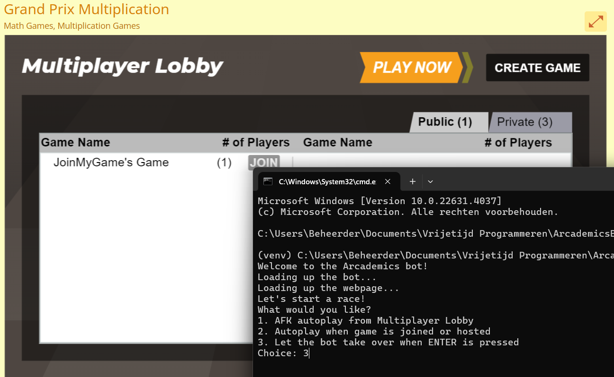

A little game automation for the [academics grand prix game]("https://www.arcademics.com/games/grand-prix")

# Installation
make sure you're in the project directory  
```shell
pip install -r requirements.txt
```
# Usage
```shell
python main.py
```
# What you can expect
When the python program is launched, a new google chrome window will open and  
the user will be prompted with a menu in his terminal.  

### current options
- AFK autoplay from Multiplayer Lobby
- Autoplay when game is joined or hosted
- Let the bot take over when ENTER is pressed

